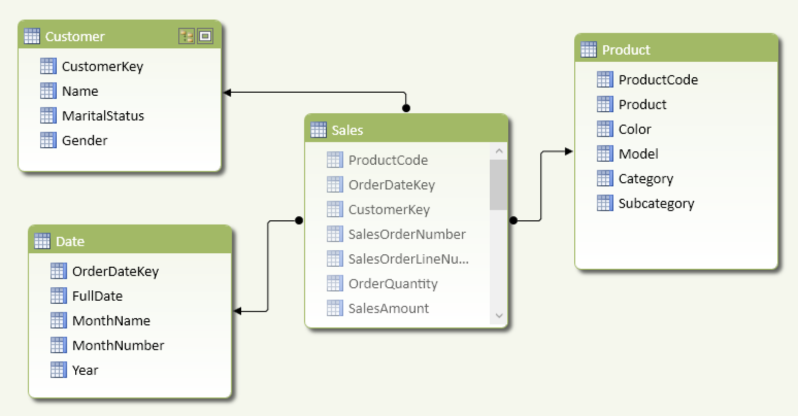

## Desafio Data Analyst
	 

### 1. Evolua o Modelo de Dados
Considere o modelo de vendas abaixo:

Os usuários nos reportaram um problema: Quando o cliente altera o estado civil na plataforma transacional, representada pela coluna  *MaritalStatus* na tabela *Customer* no modelo multi-dimensional , essa atualização é refletida para todas os registros anteriores de vendas (tabela *Sales*) no dashboard de vendas. Como podemos resolver isto alterando o modelo?

### 2. Problema: Salário mais alto do departamento
Recomendamos você utilizar o [SQLFiddle](http://sqlfiddle.com) e PostgreSQL como engine de SQL para testar suas consultas.

A tabela Employee contém todos os funcionários. Todo funcionário tem um ID, um salário e também há uma coluna para o ID do departamento.

| Id  | Name  | Salary | DepartmentId |
| --- | ---   | ---    | ---          |
| 1   | Joe   | 70000  | 1            |
| 2   | Jim   | 90000  | 1            |
| 3   | Henry | 80000  | 2            |
| 4   | Sam   | 60000  | 2            |
| 5   | Max   | 90000  | 1            |

A tabela Departamento contém todos os departamentos da empresa.

| Id  | Name     |
| --- | ---      |
| 1   | IT       |
| 2   | Sales    |

Escreva uma consulta SQL para encontrar funcionários com o salário mais alto em cada um dos departamentos. Para as tabelas acima, sua consulta SQL deve retornar as seguintes linhas (a ordem das linhas não importa).

Saída esperada:

| Department | Employee | Salary |
| ---        | ---      | ---    |
| IT         | Max      | 90000  |
| IT         | Jim      | 90000  |
| Sales      | Henry    | 80000  |

## Como entregar
Esperamos receber um arquivo através do email com o seu nome (ex.: NomeSobrenome.zip) contendo as respostas do desafio.
